\[아이의 건강한 디지털 습관 코칭 서비스\]

---

# 요구사항 분석서

---

\-남보영-

문서번호 : \[남보영\] 요구사항분석서\_260513\_Doc\_001   
소 속 : 한국항공대학교 소프트웨어학과   
팀 명 :   
팀 원 :   
교 수 : 

**제/개정 이력**

| 버전 | 날짜 | 작성자 성명 | 제/개정 사항 | 비고 |
| :---: | :---: | :---: | :---: | :---: |
| 1 |  |  | 요구사항 분석서 작성 |  |
|  |  |  |  |  |
|  |  |  |  |  |
|  |  |  |  |  |
|  |  |  |  |  |
|  |  |  |  |  |
|  |  |  |  |  |
|  |  |  |  |  |
|  |  |  |  |  |

**목 차**

### 1\. 서론

####  1.1 문서의 목적 및 범위

####  1.2 용어 정의

####  1.3 참조 문서

### 2\. 시스템 개요

####  2.1 소프트웨어 문맥도

####  2.2 기능 분류 및 설명

### 3\. 요구사항 명세

####  3.1 정적 분석

####  3.2 CRC 카드

 3.3 동적 분석

### 4\. 인터페이스 분석

 4.1 사용자 인터페이스

####  4.2 외부 시스템 인터페이스

 4.3 데이터 인터페이스

### 5\. 제약사항 

### 6\. 요구사항 추적표

### 7\. 참고문헌 및 부록

### 

# **1\. 서론**

## **1.1 문서의 목적 및 범위**

본 요구사항 분석서는 아동의 스마트폰 사용 습관을 보호자가 확인하고, AI 기반 코칭과 미션을 통해 건강한 디지털 습관 형성을 지원하는 웰폰키즈 시스템의 요구사항이 무엇인지 조사하고, 정의하는 문서이다.

이 문서는 기능적, 비기능적, 인터페이스에 요구되는 사항들을 정의한다.

## **1.2 용어 정의**

본 문서의 이해를 돕기 위해 사용된 용어 및 약어를 설명하고 정의합니다,

| 용어 | 설명 |
| :---: | :---: |
| 스마트폰 과의존 | 스마트폰 사용 조절이 어려워 일상생활, 학습, 수면, 대인관계 등에 부정적 영향을 받는 상태 |
| 코칭 | 강제 차단이 아니라 건강한 사용 습관 형성을 돕기 위해 안내하고 지도하는 방식 |
| API  | 응용 프로그램에서 사용할 수 있도록 운영체제나 프로그래밍 언어가 제공하는 기능을 제어할 수 있게 만든 인터페이스  |

## 

## **1.3 참조 문서**

## 본 문서와 관련된 이전 산출물 및 참고 문서는 다음과 같습니다.

| 문서명 | 설명 |
| :---: | :---: |
| 프로젝트 정의서 | 프로젝트 명칭, 개발 시스템 설명, 배경 및 필요성 등을 정의 |
| 시스템 품질 요소 측정 | 사용자/개발자/관리자 관점에서의 품질 요소 정의 |
| 요구사항 정의서 | 프로젝트의 요구사항을 정의 |

# 

# **2\. 시스템 개요**

## **2.1 소프트웨어 문맥(Software Context)**

### **2.1.1 Actor Table**

| Actor | Role |
| :---: | ----- |
| 보호자 | 이 시스템을 사용하는 사용자를 말한다. |
| 아동 | 이 시스템을 사용하는 사용자를 말한다. |
| AI 코칭 시스템 | 사용 기록 분석을 통한 맞춤형 피드백 및 미션을 추천하는 시스템을 말한다. |
| 알림 시스템 | 보호자/아동에게 미션, 사용 시간, 리포트 등의 알림을 제공하는 시스템을 말한다. |

### **2.1.2 UseCase Diagram**
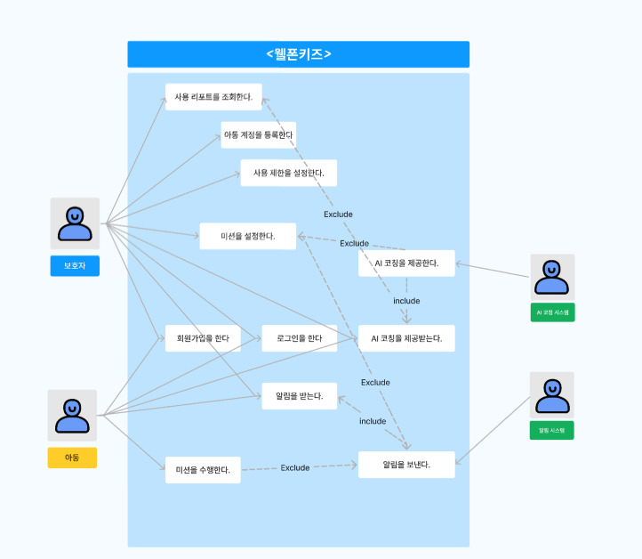

사진이 선명하지 않아 원본 링크를 함께 첨부합니다. [요구사항 분석서 다이어그램 모음](https://www.figma.com/board/ahhwIDRuI7a2NRphMgD7HR/%EC%86%8C%ED%94%84%ED%8A%B8%EC%9B%A8%EC%96%B4%EA%B3%B5%ED%95%99-%EC%9A%94%EA%B5%AC%EC%82%AC%ED%95%AD-%EB%B6%84%EC%84%9D%EC%84%9C?node-id=0-1&t=Ulxaw51oHgBKYU6L-1)

**2.2 기능 분류 및 설명**

### **2.2.1 UseCase Description**

| Use Case Name: 회원가입을 한다 | ID: U\_01 | Importance Level: high |
| :---- | :---- | :---- |
| **Primary Actor:** 보호자, 아동 |  |  |
| **Use Case Type:** Detail, Essential |  |  |
| **Brief Description:** 보호자 또는 아동이 웰폰키즈 서비스를 이용하기 위해 계정을 생성하는 Use Case를 표현한다. |  |  |
| **Stakeholders and Interests** 보호자: 아동의 스마트폰 관리를 위해 서비스 계정을 생성하길 원한다. 아동: 미션 확인 및 수행을 위해 서비스 계정을 생성하길 원한다. |  |  |
| **Trigger:** 사용자는 회원가입 버튼을 클릭한다. |  |  |
| **Relationships** Association: 보호자, 아동 Include: Extend: Generalization:  |  |  |
| **Normal Flow of Events:** 1\. 사용자는 회원가입 화면에 접속한다. 2\. 사용자는 아이디, 비밀번호, 이메일을 입력한다. 3\. 사용자는 회원가입 버튼을 클릭한다. 4\. 시스템은 회원가입이 성공한 경우 앱의 로그인화면으로 넘어간다. |  |  |
| **Subflows:** |  |  |
| **Alternate / Exceptional Flows:** 2.a1 : 필수 입력값이 누락된 경우 시스템은 누락된 항목을 안내한다. 3.a1 : 이미 사용 중인 아이디 또는 이메일이 있는 경우 시스템은 중복 오류 메시지를 출력한다. |  |  |

| Use Case Name: 로그인을 한다 | ID: U\_02 | Importance Level: high |
| :---- | :---- | :---- |
| **Primary Actor:** 보호자, 아동 |  |  |
| **Use Case Type:** Detail, Essential |  |  |
| **Brief Description:** 보호자 또는 아동이 웰폰키즈 서비스를 이용하기 위해 로그인하는 Use Case를 표현한다. |  |  |
| **Stakeholders and Interests** 보호자: 서비스를 이용하기 위해 로그인하기를 원한다. 아동: 서비스를 이용하기 위해 로그인하기를 원한다. |  |  |
| **Trigger:** 사용자는 로그인 버튼을 클릭한다. |  |  |
| **Relationships** Association: 보호자, 아동 Include: Extend: Generalization:  |  |  |
| **Normal Flow of Events:** 1\. 사용자는 로그인 화면에 접속한다. 2\. 사용자는 아이디, 비밀번호를 입력한다. 3\. 사용자는 로그인 버튼을 클릭한다. 4\. 시스템은 로그인이 성공한 경우 사용자 유형에 맞는 메인 화면으로 넘어간다. |  |  |
| **Subflows:** |  |  |
| **Alternate / Exceptional Flows:** 2.a1 : 필수 입력값이 누락된 경우 시스템은 누락된 항목을 안내한다. 3.a1 : 아이디 또는 비밀번호가 일치하지 않은 경우 시스템은 로그인 실패 메시지를 출력한다. |  |  |

| Use Case Name: 아동 계정을 등록한다. | ID: U\_03 | Importance Level: high |
| :---- | :---- | :---- |
| **Primary Actor:** 보호자 |  |  |
| **Use Case Type:** Detail, Essential |  |  |
| **Brief Description:** 보호자가 스마트폰 사용 관리를 받을 아동 계정을 등록하는 Use Case를 표현한다 |  |  |
| **Stakeholders and Interests** 보호자: 아동의 계정을 등록하여 사용 현황과 미션을 관리하길 원한다. |  |  |
| **Trigger:** 보호자가 아동 계정 등록 메뉴를 클릭한다. |  |  |
| **Relationships** Association: 보호자 Include: 로그인을 한다 Extend: Generalization:  |  |  |
| **Normal Flow of Events:** 1\. 사용자는 아동 계정 등록 메뉴를 클릭한다. 2\. 시스템은 아동 정보 입력 화면을 출력한다. 3\. 사용자는 아동의 정보를 입력한다. 4\. 사용자는 등록 버튼을 클릭한다. 5\. 시스템은 아동 계정과 보호자 계정을 연결한다. 6\. 시스템은 아동 계정 등록 완료 메시지를 출력한다. |  |  |
| **Subflows:** |  |  |
| **Alternate / Exceptional Flows:** 3.a1: 필수 정보가 입력되지 않은 경우 시스템은 누락된 항목을 안내한다. 4.a1: 이미 등록된 아동 또는 기기인 경우 시스템은 중복 등록 메시지를 출력한다. 5.a1: 계정 연결에 실패한 경우 시스템은 등록 실패 메시지를 출력한다. |  |  |

| Use Case Name: 사용 리포트를 조회한다. | ID: U\_04 | Importance Level: high |
| :---- | :---- | :---- |
| **Primary Actor:** 보호자 |  |  |
| **Use Case Type:** Detail, Essential |  |  |
| **Brief Description:** 보호자가 아동의 스마트폰 사용 시간, 앱별 사용 현황, 사용 추이를 확인하는 Use Case를 표현한다. |  |  |
| **Stakeholders and Interests** 보호자: 아동의 스마트폰 사용 습관을 파악하고 관리 방향을 결정하기를 원한다. |  |  |
| **Trigger:** 보호자가 사용 리포트 조회 메뉴를 클릭한다. |  |  |
| **Relationships** Association: 보호자 Include: 로그인을 한다 Extend: AI 코칭 결과를 조회한다. Generalization:  |  |  |
| **Normal Flow of Events:** 1\. 사용자는 사용 리포트 조회 메뉴를 클릭한다. 2\. 시스템은 보호자에게 등록된 아동 목록을 출력한다. 3\. 사용자는 조회할 아동을 선택한다. 4\. 시스템은 해당 아동의 스마트폰 사용 기록을 조회한다. 5\. 시스템은 전체 사용 시간, 앱별 사용 시간, 날짜별 사용 추이를 분석한다.  6\. 시스템은 분석 결과를 그래프와 요약 정보로 출력한다. |  |  |
| **Subflows:** |  |  |
| **Alternate / Exceptional Flows:** 2.a1: 등록된 아동 계정이 없을 경우 시스템은 아동 계정 등록 안내 메시지를 출력한다. 4.a1: 조회 가능한 사용 기록이 없는 경우 시스템은 기록 없음 메시지를 출력한다. 4.a2: 사용 기록 조회에 실패한 경우 시스템은 오류 메시지를 출력한다. |  |  |

| Use Case Name: 사용 제한을 설정한다 | ID: U\_05 | Importance Level: high |
| :---- | :---- | :---- |
| **Primary Actor:** 보호자 |  |  |
| **Use Case Type:** Detail, Essential |  |  |
| **Brief Description:** 보호자가 아동의 스마트폰 또는 특정 앱 사용 시간 제한을 설정하는 Use Case를 표현한다. |  |  |
| **Stakeholders and Interests** 보호자: 아동의 과도한 스마트폰 사용을 줄이기 위해 제한 조건을 정하길 원한다. |  |  |
| **Trigger:** 보호자가 사용 제한 설정 메뉴를 클릭한다. |  |  |
| **Relationships** Association: 보호자 Include: 로그인을 한다 Extend:  Generalization:  |  |  |
| **Normal Flow of Events:** 1\. 사용자는 사용 제한 설정 메뉴를 클릭한다. 2\. 시스템은 보호자에게 등록된 아동 목록을 출력한다. 3\. 사용자는 사용 제한을 설정할 아동을 선택한다. 4\. 시스템은 사용 제한 설정 화면을 출력한다. 5\. 보호자는 전체 사용 시간, 앱별 사용 시간 또는 제한 시간대를 입력한다. 6\. 보호자는 저장 버튼을 클릭한다. 7\. 시스템은 사용 제한 정보를 저장하고 설정 완료 메시지를 출력한다. |  |  |
| **Subflows:** |  |  |
| **Alternate / Exceptional Flows:** 2.a1: 등록된 아동 계정이 없을 경우 시스템은 아동 계정 등록 안내 메시지를 출력한다. 5.a1: 제한 시간이 올바르지 않은 형식으로 입력된 경우 시스템은 입력 오류 메시지를 출력한다. |  |  |

| Use Case Name: 미션을 설정한다. | ID: U\_06 | Importance Level: high |
| :---- | :---- | :---- |
| **Primary Actor:** 보호자 |  |  |
| **Use Case Type:** Detail, Essential |  |  |
| **Brief Description:** 보호자가 아동에게 스마트폰 사용 습관 개선을 위한 미션을 설정하는 Use Case를 표현한다. |  |  |
| **Stakeholders and Interests** 보호자: 아동의 스마트폰 사용을 줄이고 건강한 생활 습관을 형성하도록 미션을 제공하길 원한다. |  |  |
| **Trigger:** 보호자가 미션 설정 메뉴를 선택한다. |  |  |
| **Relationships** Association: 보호자 Include: 로그인을 한다 Extend: 알림을 보낸다 Generalization:  |  |  |
| **Normal Flow of Events:** 1\. 보호자는 미션 설정 메뉴를 선택한다. 2\. 시스템은 등록된 아동 목록을 출력한다. 3\. 보호자는 미션을 부여할 아동을 선택한다. 4\. 시스템은 기본 미션 목록과 AI 추천 미션을 출력한다. 5\. 보호자는 미션 내용, 목표, 수행 기간을 설정한다. 6\. 보호자는 저장 버튼을 선택한다. 7\. 시스템은 미션 정보를 저장한다. 8\. 시스템은 아동에게 미션 알림을 전송한다. 9.시스템은 미션 설정 완료 메시지를 출력한다. |  |  |
| **Subflows:** |  |  |
| **Alternate / Exceptional Flows:** 4.a1 : AI 추천 미션이 없는 경우 시스템은 기본 미션 목록만 출력한다. 5.a1 : 미션 내용 또는 수행 기간이 입력되지 않은 경우 시스템은 필수 입력 안내 메시지를 출력한다. |  |  |

| Use Case Name: 미션을 수행한다. | ID: U\_07 | Importance Level: high |
| :---- | :---- | :---- |
| **Primary Actor:** 아동 |  |  |
| **Use Case Type:** Detail, Essential |  |  |
| **Brief Description:** 아동이 보호자가 설정한 미션을 확인하고 수행 결과를 기록하는 Use Case를 표현한다. |  |  |
| **Stakeholders and Interests** 아동: 자신에게 주어진 미션을 확인하고 수행하길 원한다. |  |  |
| **Trigger:** 아동이 미션 화면에 접속한다. |  |  |
| **Relationships** Association: 아동 Include: 로그인을 한다 Extend: 알림을 보낸다 Generalization:  |  |  |
| **Normal Flow of Events:** 1\. 아동은 미션 화면에 접속한다. 2\. 시스템은 현재 진행 중인 미션 목록을 출력한다. 3\. 아동은 수행할 미션을 선택한다. 4\. 아동은 미션 수행 후 완료 버튼을 선택한다. 5\. 시스템은 미션 수행 상태를 완료로 변경한다. 6\. 시스템은 보호자에게 미션 완료 알림을 전송한다. 7\. 시스템은 미션 완료 메시지를 출력한다. |  |  |
| **Subflows:** |  |  |
| **Alternate / Exceptional Flows:** 2.a1 : 진행 중인 미션이 없는 경우 시스템은 미션 없음 메시지를 출력한다. 5.a1 : 미션 수행 기간이 지난 경우 시스템은 완료 처리 불가 메시지를 출력한다. |  |  |

| Use Case Name: AI 코칭을 제공한다. | ID: U\_08 | Importance Level: mid |
| :---- | :---- | :---- |
| **Primary Actor:** AI 코칭 시스템 |  |  |
| **Use Case Type:** Detail, Essential |  |  |
| **Brief Description:** AI 코칭 시스템이 아동의 스마트폰 사용 기록을 분석하여 맞춤형 코칭 결과와 추천 미션을 제공하는 Use Case를 표현한다. |  |  |
| **Stakeholders and Interests** 보호자: 아동에게 적절한 관리 방향과 미션 추천을 제공받길 원한다. 아동: 자신의 사용 습관에 맞는 피드백을 제공받길 원한다. AI 코칭 시스템: 사용 기록을 바탕으로 코칭 결과를 생성한다. |  |  |
| **Trigger:** 시스템이 사용 기록 분석 또는 AI 코칭 결과 생성을 요청한다. |  |  |
| **Relationships** Association: AI 코칭 시스템 Include:  Extend: 미션을 설정한다, 사용 리포트를 조회한다 Generalization:  |  |  |
| **Normal Flow of Events:** 1\. 시스템은 아동의 스마트폰 사용 기록을 수집한다. 2\. 시스템은 AI 코칭 시스템에 사용 기록 분석을 요청한다. 3\. AI 코칭 시스템은 사용 시간, 앱 사용 패턴, 미션 수행 기록을 분석한다. 4\. AI 코칭 시스템은 아동에게 적합한 코칭 결과를 생성한다. 5\. AI 코칭 시스템은 추천 미션을 생성한다. 6\. 시스템은 AI 코칭 결과와 추천 미션을 저장한다. |  |  |
| **Subflows:** |  |  |
| **Alternate / Exceptional Flows:** 1.a1 : 분석 가능한 사용 기록이 없는 경우 시스템은 AI 코칭 결과를 생성하지 않는다. 2.a1 : AI 코칭 시스템 연결에 실패한 경우 시스템은 코칭 결과 생성 실패 메시지를 저장한다. 4.a1 : 분석 결과가 충분하지 않은 경우 시스템은 기본 코칭 메시지를 제공한다. |  |  |

| Use Case Name: AI 코칭 결과를 조회한다. | ID: U\_09 | Importance Level: mid |
| :---- | :---- | :---- |
| **Primary Actor:** 보호자, 아동 |  |  |
| **Use Case Type:** Detail, Essential |  |  |
| **Brief Description:** 사용자가 AI 코칭 시스템이 생성한 스마트폰 사용 습관 피드백과 추천 미션을 확인하는 Use Case를 표현한다. |  |  |
| **Stakeholders and Interests** 보호자: 아동의 스마트폰 사용 습관에 대한 분석 결과를 확인하길 원한다.  아동: 자신의 사용 습관에 대한 피드백을 확인하기 원한다. |  |  |
| **Trigger:** 사용자가 AI 코칭 결과 조회 메뉴를 클릭한다. |  |  |
| **Relationships** Association: 보호자, 아동 Include: AI 코칭을 제공한다 Extend: 미션을 설정한다 Generalization:  |  |  |
| **Normal Flow of Events:** 1\. 사용자는 AI 코칭 결과 조회 메뉴를 선택한다. 2\. 시스템은 해당 아동의 AI 코칭 결과를 조회한다. 3\. 시스템은 스마트폰 사용 습관 분석 결과를 출력한다. 4\. 시스템은 추천 미션 또는 개선 방향을 함께 출력한다. |  |  |
| **Subflows:** |  |  |
| **Alternate / Exceptional Flows:** 3.a1 : AI 코칭 결과가 없는 경우 시스템은 결과 없음 메시지를 출력한다. 3.a2 : 조회 중 오류가 발생한 경우 시스템은 오류 메시지를 출력한다. |  |  |

| Use Case Name: 알림을 확인한다. | ID: U\_10 | Importance Level: mid |
| :---- | :---- | :---- |
| **Primary Actor:** 보호자, 아동 |  |  |
| **Use Case Type:** Detail, Essential |  |  |
| **Brief Description:** 사용자가 미션, 사용 제한, AI 코칭 결과, 사용 시간 등과 관련된 알림을 확인하는 Use Case를 표현한다. |  |  |
| **Stakeholders and Interests** 보호자: 아동의 미션 완료, 사용 시간 초과, 리포트 생성 여부를 확인하길 원한다. 아동: 자신에게 부여된 미션이나 사용 제한 관련 알림을 확인하길 원한다. |  |  |
| **Trigger:** 사용자가 알림 메뉴를 선택하거나 시스템 알림을 수신한다. |  |  |
| **Relationships** Association: 보호자, 아동 Include: 알림을 보낸다 Extend:  Generalization:  |  |  |
| **Normal Flow of Events:** 1\. 사용자는 알림 메뉴를 선택한다. 2\. 시스템은 사용자에게 전달된 알림 목록을 조회한다. 3\. 시스템은 알림 제목, 내용, 발생 시간을 출력한다. 4\. 사용자는 확인할 알림을 선택한다. 5\. 시스템은 알림 상세 내용을 출력한다. 6\. 시스템은 해당 알림을 읽음 상태로 변경한다. |  |  |
| **Subflows:** |  |  |
| **Alternate / Exceptional Flows:** 2.a1 : 알림 목록 조회에 실패한 경우 시스템은 오류 메시지를 출력한다. 6.a1 : 읽음 상태 변경에 실패한 경우 시스템은 기존 상태를 유지한다. |  |  |

| Use Case Name: 알림을 보낸다 | ID: U\_11 | Importance Level: mid |
| :---- | :---- | :---- |
| **Primary Actor:** 알림 시스템 |  |  |
| **Use Case Type:** Detail, Essential |  |  |
| **Brief Description:** 알림 시스템이 미션 부여, 미션 완료, 사용 시간, AI 코칭 결과 생성 등의 상황에서 사용자에게 알림을 전송하는 Use Case를 표현한다. |  |  |
| **Stakeholders and Interests** 보호자: 아동의 스마트폰 사용 상태와 미션 수행 결과를 즉시 확인하길 원한다. 아동: 자신에게 부여된 미션이나 사용 제한 정보를 즉시 확인하길 원한다. 알림 시스템: 필요한 상황에 적절한 대상에게 알림을 전송한다. |  |  |
| **Trigger:** 미션 설정, 미션 완료, 사용 시간 초과, AI 코칭 결과 생성 등의 이벤트가 발생한다. |  |  |
| **Relationships** Association: 알림 시스템 Include:  Extend: 알림을 확인한다 Generalization:  |  |  |
| **Normal Flow of Events:** 1\. 시스템은 알림이 필요한 이벤트를 감지한다. 2\. 시스템은 알림 대상자를 확인한다. 3\. 시스템은 알림 내용을 생성한다. 4\. 시스템은 알림 시스템에 알림 전송을 요청한다. 5\. 알림 시스템은 보호자 또는 아동에게 알림을 전송한다. |  |  |
| **Subflows:** |  |  |
| **Alternate / Exceptional Flows:** 2.a1 : 알림 대상자가 존재하지 않는 경우 시스템은 알림을 전송하지 않는다. 4.a1 : 알림 시스템 연결에 실패한 경우 시스템은 전송 실패 상태를 저장한다. 5.a1 : 사용자의 알림 수신 설정이 꺼져 있는 경우 시스템은 알림을 전송하지 않는다. |  |  |

# 

# **3\. 요구사항 명세**

## **3.1 정적 분석**
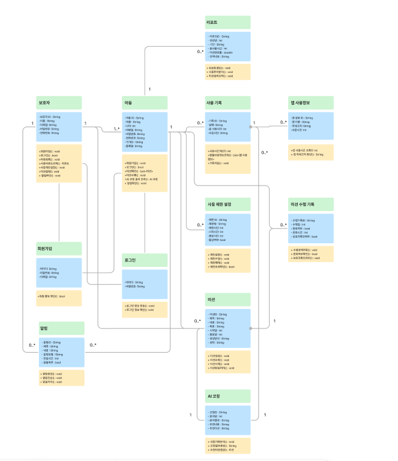

사진이 선명하지 않아 원본 링크를 함께 첨부합니다. [요구사항 분석서 다이어그램 모음](https://www.figma.com/board/ahhwIDRuI7a2NRphMgD7HR/%EC%86%8C%ED%94%84%ED%8A%B8%EC%9B%A8%EC%96%B4%EA%B3%B5%ED%95%99-%EC%9A%94%EA%B5%AC%EC%82%AC%ED%95%AD-%EB%B6%84%EC%84%9D%EC%84%9C?node-id=0-1&t=Ulxaw51oHgBKYU6L-1)

## **3.2 CRC 카드**

| Class Name: 보호자 | ID: 01 |  | Type: Concrete, Domain |
| :---- | :---- | :---- | :---- |
| **Description:** 서비스를 사용하는 사용자를 나타낸다. |  |  | **Associated Use Case:** U\_01, U\_02, U\_03, U\_04, U\_05, U\_06, U\_09, U\_10  |
| **Responsibilities:**  \-회원가입() : void \-로그인() : bool \-아동등록() : void \-사용리포트조회() : 리포트 \-사용제한설정() : void \-미션설정(): void \- 알림확인() : void  |  | **Collaborations:** \-아동 \-사용기록 \-사용제한설정 \-미션 \-AI코칭 \-리포트 \-알림 |  |
| **Attributes** \-보호자 ID : String \-이름 : String \-이메일: String \-비밀번호: String \-전화번호: String  |  |  |  |
| **Relationships** \- Generalization:  \-Aggregation: 아동 \-Other Associations: 미션, 사용제한설정, 리포트, 알림 |  |  |  |

| Class Name: 아동 | ID: 02 |  | Type: Concrete, Domain |
| :---- | :---- | :---- | :---- |
| **Description:** 서비스를 사용하는 사용자를 나타낸다. |  |  | **Associated Use Case:** U\_01, U\_02, U\_03, U\_04, U\_07, U\_09, U\_10  |
| **Responsibilities:**  \-회원가입() : void \-로그인() : bool \-미션확인() : List\<미션\> \-미션수행() : void \-AI 코칭 결과 조회() : AI 코칭 \- 알림확인() : void  |  | **Collaborations:** \-보호자 \-사용기록 \-사용제한설정 \-미션 \-미션수행기록 \-AI코칭 \-리포트 \-알림 |  |
| **Attributes** \-아동 ID : String \-이름 : String \-나이: Int \-이메일: String \-비밀번호: String \-전화번호: String \-기기ID : String \-등록일: String  |  |  |  |
| **Relationships** \-Generalization:  \-Aggregation: 사용기록, 미션수행기록 \-Other Associations: 보호자, 미션, 사용제한설정, AI코칭, 리포트, 알림 |  |  |  |

## 

## 

| Class Name: 사용기록 | ID: 03 |  | Type: Concrete, Domain |
| :---- | :---- | :---- | :---- |
| **Description:** 아동의 스마트폰 사용 시간과 앱별 사용 내역을 저장하는 정보를 나타낸다. |  |  | **Associated Use Case:** U\_04, U\_08, U\_09  |
| **Responsibilities:**  \-사용시간계산(): Int \-앱별사용정보조회() : List\<앱 사용정보\> \-기록저장() : void  |  | **Collaborations:** \-아동 \-앱사용정보 \-AI코칭 \-리포트 |  |
| **Attributes** \-기록 ID : String \-날짜: String \-총 사용시간: Int \-수집시간: String  |  |  |  |
| **Relationships** \-Generalization:  \-Aggregation: 앱사용정보 \-Other Associations: 아동, AI코칭, 리포트 |  |  |  |

| Class Name: 앱사용정보 | ID: 04 |  | Type: Concrete, Domain |
| :---- | :---- | :---- | :---- |
| **Description:** 아동이 사용한 개별 앱의 사용 시간과 카테고리 정보를 나타낸다. |  |  | **Associated Use Case:** U\_04, U\_08 |
| **Responsibilities:**  \-앱 사용시간 조회(): Int \- 앱 카테고리 확인() : String  |  | **Collaborations:** \-사용기록 |  |
| **Attributes** \-앱 정보 ID : String \-앱 이름 : String \-카테고리: String \-사용시간: Int |  |  |  |
| **Relationships** \-Generalization:  \-Aggregation: \-Other Associations: 사용기록 |  |  |  |

| Class Name: 사용제한설정 | ID: 05 |  | Type: Concrete, Domain |
| :---- | :---- | :---- | :---- |
| **Description:** 보호자가 아동의 스마트폰 또는 특정 앱 사용을 제한하기 위해 설정한 정보를 나타낸다. |  |  | **Associated Use Case:** U\_05, U\_10  |
| **Responsibilities:**  \-제한설정() : void
 \- 제한수정() : void
 \- 제한해제() : void
 \- 제한초과확인() : bool  |  | **Collaborations:** \-보호자 \-아동 \-알림 |  |
| **Attributes** \-제한 ID : String \-제한앱 : String \-제한시간: Int \-시작시간: Int \-종료시간: Int \-활성여부: bool  |  |  |  |
| **Relationships** \-Generalization:  \-Aggregation:  \-Other Associations: 보호자, 아동, 알림 |  |  |  |

| Class Name: 미션 | ID: 06 |  | Type: Concrete, Domain |
| :---- | :---- | :---- | :---- |
| **Description:** 아동의 스마트폰 사용 습관 개선을 위해 제공되는 미션을 나타낸다. |  |  | **Associated Use Case:** U\_06, U\_07, U\_08, U\_10 |
| **Responsibilities:**  \- 미션생성() : void
 \- 미션수정() : void
 \- 미션삭제() : void
 \- 미션완료처리() : void  |  | **Collaborations:** \-보호자 \-아동 \-AI코칭 \-미션수행기록 \-알림 |  |
| **Attributes** \- 미션ID : String
 \- 제목 : String
 \- 내용 : String
 \- 목표 : String
 \- 시작일 : Int
 \- 종료일 : Int
 \- 생성방식 : String
 \- 상태 : String  |  |  |  |
| **Relationships** \-Generalization:  \-Aggregation: 미션수행기록 \-Other Associations: 보호자, 아동, AI코칭, 알림 |  |  |  |

| Class Name: 미션수행기록 | ID: 07 |  | Type: Concrete, Domain |
| :---- | :---- | :---- | :---- |
| **Description:** 아동이 미션을 수행한 결과와 완료 여부를 저장하는 정보를 나타낸다. |  |  | **Associated Use Case:** U\_07, U\_09 |
| **Responsibilities:**  \- 수행상태저장() : void
 \- 완료여부확인() : bool
 \- 보호자확인처리() : void  |  | **Collaborations:** \-아동 \-미션 \-리포트 |  |
| **Attributes** \- 수행기록ID : String
 \- 수행일 : Int
 \- 완료여부 : bool
 \- 완료시간 : Int
 \- 보호자확인여부 : bool  |  |  |  |
| **Relationships** \-Generalization:  \-Aggregation:  \-Other Associations: 아동, 미션, 리포트 |  |  |  |

| Class Name: AI코칭 | ID: 08 |  | Type: Concrete, Domain |
| :---- | :---- | :---- | :---- |
| **Description:** 아동의 스마트폰 사용 기록을 분석하여 맞춤형 코칭 결과와 추천 미션을 생성하는 정보를 나타낸다. |  |  | **Associated Use Case:** U\_08, U\_09 |
| **Responsibilities:**  \- 사용기록분석() : void
 \- 코칭결과생성() : String
 \- 추천미션생성() : 미션  |  | **Collaborations:** \-아동 \-사용기록 \-미션 \-리포트 |  |
| **Attributes** \- 코칭ID : String
 \- 분석일 : Int
 \- 분석결과 : String
 \- 추천내용 : String
 \- 추천미션 : String  |  |  |  |
| **Relationships** \-Generalization:  \-Aggregation:  \-Other Associations: 아동, 사용기록, 미션, 리포트 |  |  |  |

| Class Name: 리포트 | ID: 09 |  | Type: Concrete, Domain |
| :---- | :---- | :---- | :---- |
| **Description:** 아동의 스마트폰 사용 현황, 사용 추이, 미션 수행 결과를 요약한 정보를 나타낸다. |  |  | **Associated Use Case:** U\_04, U\_09 |
| **Responsibilities:**  \- 리포트생성() : void
 \- 사용추이분석() : void
 \- 미션결과요약() : void  |  | **Collaborations:** \-아동 \-사용기록 \-미션수행기록 \-AI코칭 |  |
| **Attributes** \- 리포트ID : String 
-생성일 : Int
 \- 기간 : String
 \- 총사용시간 : Int
 \- 미션완료율 : double \- 요약내용 : String  |  |  |  |
| **Relationships** \-Generalization:  \-Aggregation: 사용기록, 미션수행기록 \-Other Associations: 아동, AI코칭 |  |  |  |

| Class Name: 알림 | ID: 10 |  | Type: Concrete, Domain |
| :---- | :---- | :---- | :---- |
| **Description:** 미션, 사용 제한, 리포트, AI 코칭 결과와 관련하여 보호자 또는 아동에게 전달되는 메시지를 나타낸다. |  |  | **Associated Use Case:** U\_10, U\_11 |
| **Responsibilities:**  \- 알림생성() : void
 \- 알림전송() : void
 \- 읽음처리() : void  |  | **Collaborations:** \-보호자 \-아동 \-미션 \-사용제한설정 \-리포트 \-AI코칭 |  |
| **Attributes** \- 알림ID : String
 \- 제목 : String
 \- 내용 : String
 \- 알림유형 : String
 \- 전송시간 : Int
 \- 읽음여부 : bool  |  |  |  |
| **Relationships** \-Generalization:  \-Aggregation:  \-Other Associations: 보호자, 아동, 미션, 사용제한설정, 리포트,  AI코칭 |  |  |  |

## 

## 

## 

## 

## **3.3 동적 분석**

3.3.1 회원가입을 한다
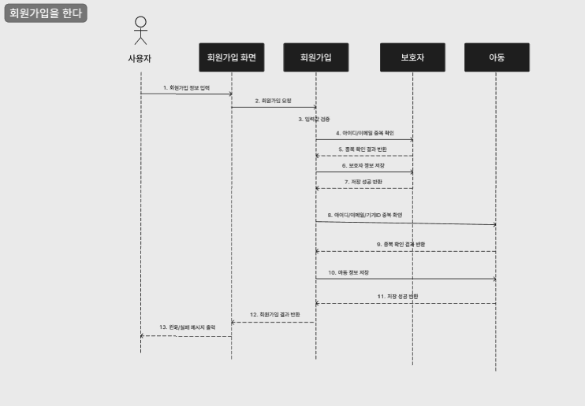 

3.3.2 로그인을 한다  
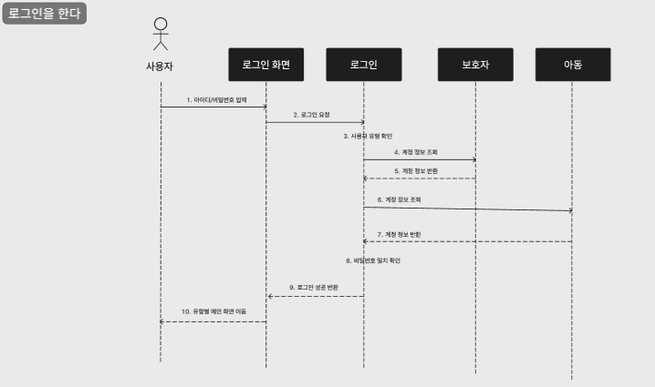 

3.3.3 아동 계정을 등록한다  
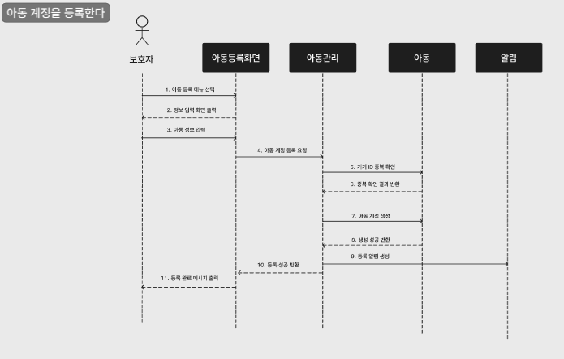 

3.3.4 사용 리포트를 조회한다  
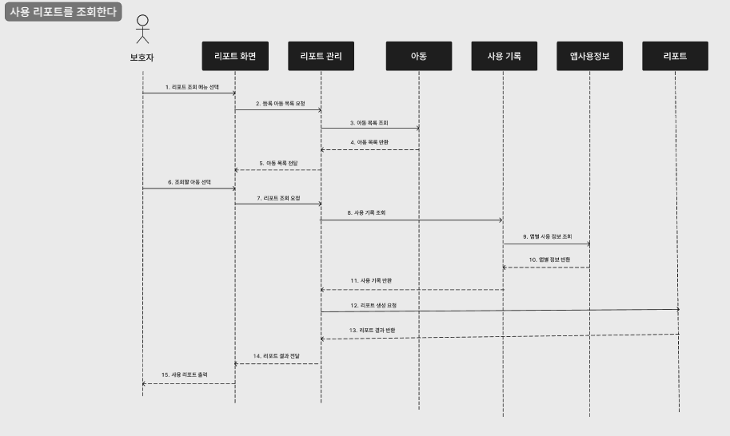 

3.3.5 사용 제한을 설정한다  
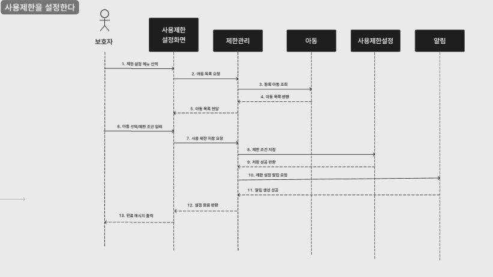 

3.3.6 미션을 설정한다  
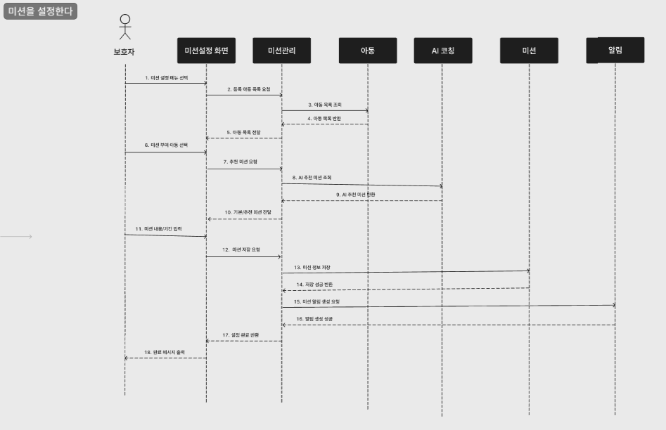 

3.3.7 미션을 수행한다  
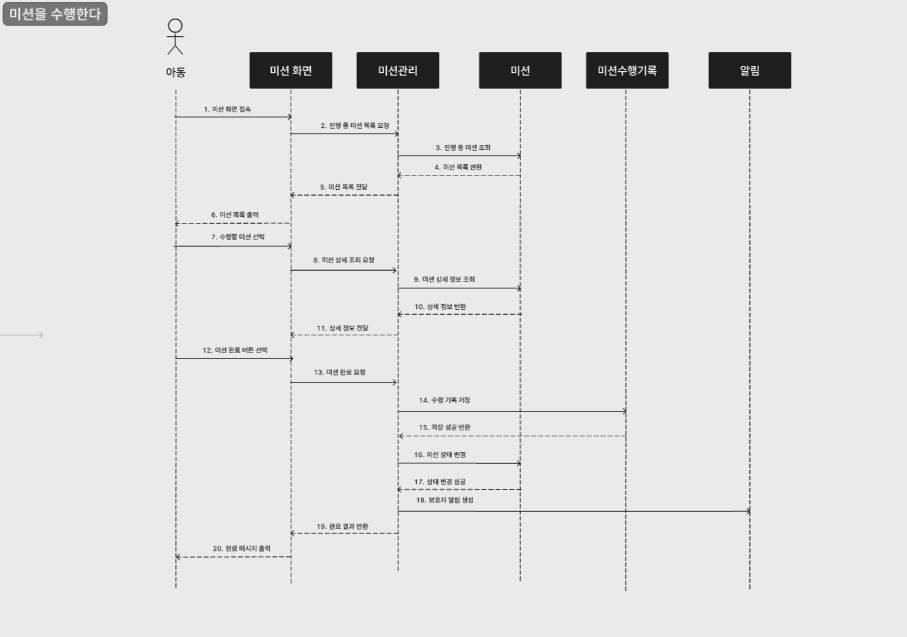 

3.3.8 AI 코칭 결과를 조회한다  
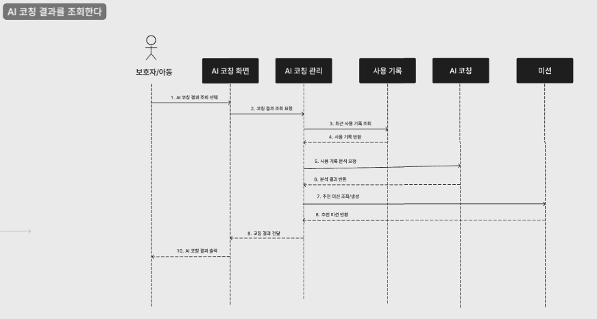 

3.3.9 알림을 확인한다  
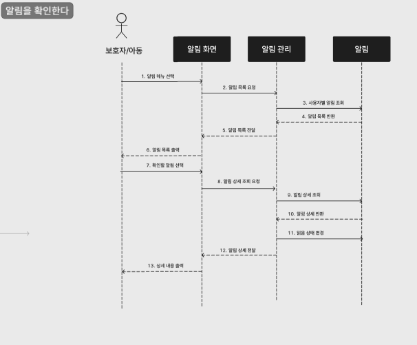 

사진이 선명하지 않아 원본 링크를 함께 첨부합니다. [요구사항 분석서 다이어그램 모음](https://www.figma.com/board/ahhwIDRuI7a2NRphMgD7HR/%EC%86%8C%ED%94%84%ED%8A%B8%EC%9B%A8%EC%96%B4%EA%B3%B5%ED%95%99-%EC%9A%94%EA%B5%AC%EC%82%AC%ED%95%AD-%EB%B6%84%EC%84%9D%EC%84%9C?node-id=0-1&t=Ulxaw51oHgBKYU6L-1)

# **4\. 인터페이스 분석**

## **4.1 사용자 인터페이스**

| 인터페이스명 | 대상 사용자 | 설명 |
| :---- | :---- | :---- |
| 회원가입 화면 | 보호자, 아동 | 사용자가 서비스 이용을 위해 계정 정보를 입력하고 회원가입을 수행하는 화면 |
| 로그인 화면 | 보호자, 아동 | 사용자가 아이디와 비밀번호를 입력하여 서비스에 접속하는 화면 |
| 아동 계정 등록 화면 | 보호자 | 보호자가 관리할 아동의 이름, 나이, 기기 등의 정보를 등록하는 화면 |
| 사용 리포트 조회 화면 | 보호자 | 아동의 스마트폰 전체 사용 시간, 앱별 사용 시간, 사용 추이를 확인하는 화면 |
| 사용 제한 설정 화면 | 보호자 | 아동의 전체 스마트폰 사용 시간 또는 특정 앱 사용 시간을 제한하는 화면 |
| 미션 설정 화면 | 보호자 | 보호자가 기본 미션, 직접 작성 미션, AI 추천 미션 중 하나를 선택하여 아동에게 부여하는 화면 |
| 미션 수행 화면 | 아동 | 자신에게 부여된 미션을 확인하고 수행 완료 여부를 기록하는 화면 |
| AI 코칭 결과 화면 | 보호자, 아동 | 사용 기록을 바탕으로 생성된 AI 코칭 결과와 추천 미션을 확인하는 화면 |
| 알림 화면 | 보호자, 아동 | 미션 부여, 미션 완료, 사용 시간 초과, 리포트 생성 등의 알림을 확인하는 화면 |

## **4.2 외부 시스템 인터페이스**

| 인터페이스명 | 연동 대상 | 설명 |
| :---- | :---- | :---- |
| AI 코칭 인터페이스 | AI 코칭 시스템 | 아동의 스마트폰 사용 기록, 앱별 사용 시간, 미션 수행 기록을 전달하고 맞춤형 코칭 결과와 추천 미션을 반환받는다. |
| 알림 전송 인터페이스 | 알림 시스템 | 미션 설정, 미션 완료, 사용 제한 초과, 리포트 생성 등의 이벤트가 발생했을 때 보호자 또는 아동에게 알림을 전송한다. |
| 사용 기록 수집 인터페이스 | 아동 기기 또는 사용 기록 모듈 | 아동의 스마트폰 전체 사용 시간과 앱별 사용 시간을 수집하여 시스템에 저장한다. |

## **4.3 데이터 인터페이스**

| 데이터 | 관련 기능 | 설명 |
| :---- | :---- | :---- |
| 보호자 정보 | 회원가입, 로그인, 아동 계정 등록 | 아이디, 비밀번호, 이름, 이메일, 연락처 등을 저장하고 인증에 활용한다. |
| 아동 정보 | 아동 계정 등록, 사용 리포트 조회, 미션 수행 | 아이디, 비밀번호, 이름, 이메일, 연락처, 나이, 기기ID, 등록일 등을 저장한다 |
| 사용 기록 | 사용 리포트 조회, AI 코칭 결과 조회 | 아동의 날짜별 스마트폰 사용 시간과 앱별 사용 정보를 저장한다 |
| 앱 사용 정보 | 사용 리포트 조회, AI 코칭 분석 | 앱 이름, 앱 카테고리, 사용 시간 등을 저장한다 |
| 사용 제한 설정 정보 | 사용 제한 설정, 알림 전송 | 제한 앱, 제한 시간, 활성 여부 등을 저장한다 |
| 미션 정보 | 미션 설정, 미션 수행, AI 추천 미션 | 미션 제목, 내용, 목표, 수행 기간, 생성 방식, 상태를 저장한다 |
| 미션 수행 기록 | 미션 수행, 리포트 생성 | 아동의 미션 완료 여부, 완료 시간, 보호자 확인 여부를 저장한다. |
| AI 코칭 결과 | AI 코칭 결과 조회, 미션 설정 | 분석 결과, 추천 내용, 추천 미션을 저장한다 |
| 리포트 정보 | 사용 리포트 조회 | 사용 시간 요약, 앱별 사용 추이, 미션 완료율, 요약 내용을 저장한다 |
| 알림 정보 | 알림 확인 | 알림 제목, 내용, 유형, 전송 시간, 읽음 여부를 저장한다 |

# 

# **5\. 제약사항**

1\. 본 시스템은 아동과 보호자의 개인정보 및 스마트폰 사용 기록을 다루므로 개인정보 보호가 필요하다.

2\. 보호자는 본인이 등록한 아동의 정보, 사용 기록, 미션 수행 기록, 리포트만 조회하고 관리할 수 있어야 한다.

3\. 아동은 본인에게 부여된 미션, AI 코칭 결과, 알림만 확인할 수 있어야 한다.

4\. 스마트폰 사용 기록은 일정 주기마다 수집되므로 실제 사용 시간과 시스템에 표시되는 사용 시간 사이에 차이가 발생할 수 있다.

5\. 사용 기록 수집 및 사용 제한 기능은 아동 기기의 권한 설정, 운영체제 정책, 네트워크 상태에 따라 제한될 수 있다.

6\. AI 코칭 결과와 추천 미션은 사용 기록을 바탕으로 생성되는 참고용 정보이며, 보호자의 판단을 완전히 대체하지 않는다.

7\. AI 추천 미션은 보호자가 최종적으로 확인한 후 아동에게 적용할 수 있어야 한다.

8\. 미션은 아동의 연령과 생활 습관을 고려하여 과도하지 않은 수준으로 제공되어야 한다.

9\. 알림은 네트워크 상태, 기기 설정, 알림 수신 허용 여부에 따라 지연되거나 수신되지 않을 수 있다.

10\. 시스템 장애 또는 서버 연결 오류가 발생할 경우 사용 기록 조회, 리포트 생성, AI 코칭 결과 조회, 알림 전송 기능이 일시적으로 제한될 수 있다. 

# 

# **6\. 요구사항 추적표**

|  |  |Use Case|  |  |  |  |  |  |  |  |  |  |
|---|:---:|:---:|:---:|:---:|:---:|:---:|:---:|:---:|:---:|:---:|:---:|:---:|
|  |  |U\_01|U\_02|U\_03|U\_04|U\_05|U\_06|U\_07|U\_08|U\_09|U\_10|U\_11|
|**요구사항**|FR\_001|  |  |  |O|  |  |  |  |  |  |  |
|  |FR\_002|  |  |  |O|  |  |  |O|  |  |  |
|  |FR\_003|  |  |  |O|O|  |  |  |  |  |  |
|  |FR\_004|  |  |  |O|  |  |  |  |  |  |  |
|  |FR\_005|  |  |  |  |  |  |  |O|  |  |  |
|  |FR\_006|  |  |  |  |  |  |  |O|  |  |  |
|  |FR\_007|  |  |  |O|O|  |  |O|  |  |  |
|  |FR\_008|  |  |  |  |  |  |  |O|  |  |  |
|  |FR\_009|  |  |  |  |O|  |  |  |  |  |  |
|  |FR\_010|  |  |  |  |O|  |  |  |  |  |  |
|  |FR\_011|  |  |  |  |O|  |  |  |  |  |  |
|  |FR\_012|  |  |  |O|O|  |  |  |  |  |  |
|  |FR\_013|  |  |  |O|O|  |  |  |O|  |  |
|  |FR\_014|  |  |  |O|O|O|  |O|  |  |  |
|  |FR\_015|  |  |  |  |  |  |O|  |  |  |  |
|  |FR\_016|  |  |  |  |  |  |O|  |O|  |  |
|  |FR\_017|  |  |  |  |  |  |O|  |  |  |  |
|  |FR\_018|  |  |  |O|O|  |  |  |  |  |  |

#

|  |  |Use Case|  |  |  |  |  |  |  |  |  |  |
|---|:---:|:---:|:---:|:---:|:---:|:---:|:---:|:---:|:---:|:---:|:---:|:---:|
|  |  |U\_01|U\_02|U\_03|U\_04|U\_05|U\_06|U\_07|U\_08|U\_09|U\_10|U\_11|
|**요구사항**|FR\_019|  |  |  |  |O|  |  |  |O|  |  |
|  |FR\_020|  |  |  |  |O|  |  |  |O|  |  |
|  |FR\_021|  |  |  |  |O|  |  |  |O|  |O|
|  |FR\_022|  |  |  |  |  |  |O|  |O|  |O|
|  |FR\_023|  |  |  |O|  |  |  |  |O|  |O|
|  |FR\_024|  |  |  |  |  |  |  |  |  |O|O|
|  |FR\_025|O|  |  |  |  |  |  |  |  |  |  |
|  |FR\_026|  |O|  |  |  |  |  |  |  |  |  |
|  |FR\_027|  |O|O|  |  |  |  |  |  |  |  |
|  |FR\_028|  |O|O|  |O|  |  |  |  |  |  |
|  |FR\_029|  |O|  |  |  |  |  |  |  |  |  |
|  |FR\_030|  |O|O|  |O|  |  |  |  |  |  |
|  |FR\_031|  |O|  |  |  |  |  |  |  |  |O|

대부분의 주요 기능은 로그인 후 이용 가능한 기능이므로 U_03~U_10은 U_02와 Include 관계를 가진다. 
단, 추적표에서는 각 요구사항을 직접 수행하는 유스케이스를 중심으로 매핑하였다.

# **7\. 참고문헌 및 부록**

\[부록 1\] 웰폰키즈 프로젝트 정의서 (project1\_definition.md)

\[부록 2\] 웰폰키즈  대상 시스템 품질 요소 추정 (project2\_quality.md)

\[부록 3\] 웰폰키즈 요구사항 정의서(project\_requirement\_definition.md) 